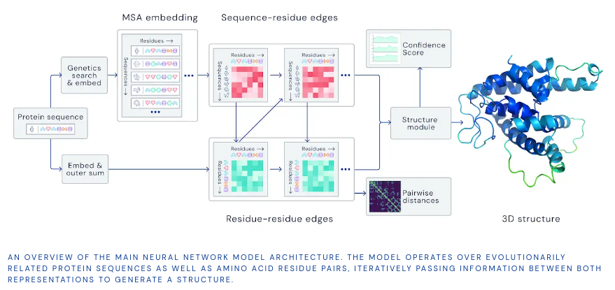
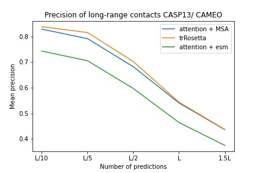
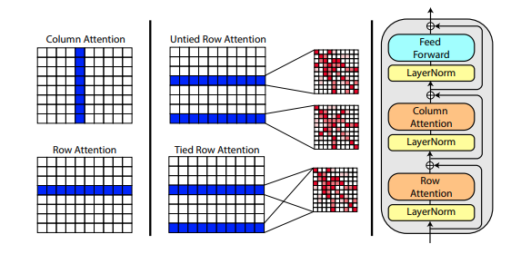
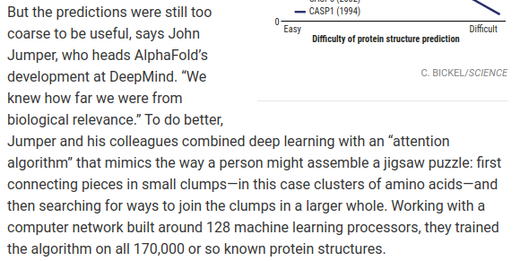
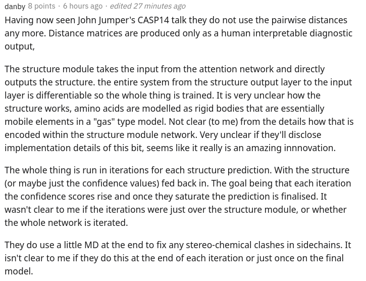

</img>

## Alphafold2 - Pytorch (wip)

To eventually become an unofficial working Pytorch implementation of <a href="https://deepmind.com/blog/article/alphafold-a-solution-to-a-50-year-old-grand-challenge-in-biology">Alphafold2</a>, the breathtaking attention network that solved CASP14. Will be gradually implemented as more details of the architecture is released.

Once this is replicated, I intend to fold all available amino acid sequences out there in-silico and release it as an academic torrent, to further science. If you are interested in replication efforts, please drop by #alphafold at this <a href="https://discord.gg/GgDBFP8ZEt">Discord channel</a>

Update: Deepmind has open sourced the official <a href="https://github.com/deepmind/alphafold">code</a> in Jax, along with the weights 🙏! This repository will now be geared towards a straight pytorch translation with some improvements on positional encoding

<a href="https://www.youtube.com/watch?v=nGVFbPKrRWQ">ArxivInsights video</a>

## Install

```bash
$ pip install alphafold2-pytorch
```

## Status

<a href="https://github.com/lhatsk">lhatsk</a> has reported training a modified trunk of this repository, using the same setup as trRosetta, with competitive results

</img>

`blue used the the trRosetta input (MSA -> potts -> axial attention), green used the ESM embedding (only sequence) -> tiling -> axial attention` - lhatsk

## Usage

Predicting distogram, like Alphafold-1, but with attention

```python
import torch
from alphafold2_pytorch import Alphafold2

model = Alphafold2(
    dim = 256,
    depth = 2,
    heads = 8,
    dim_head = 64,
    reversible = False  # set this to True for fully reversible self / cross attention for the trunk
).cuda()

seq = torch.randint(0, 21, (1, 128)).cuda()      # AA length of 128
msa = torch.randint(0, 21, (1, 5, 120)).cuda()   # MSA doesn't have to be the same length as primary sequence
mask = torch.ones_like(seq).bool().cuda()
msa_mask = torch.ones_like(msa).bool().cuda()

distogram = model(
    seq,
    msa,
    mask = mask,
    msa_mask = msa_mask
) # (1, 128, 128, 37)
```

You can also turn on prediction for the angles, by passing a `predict_angles = True` on init. The below example would be equivalent to <a href="https://github.com/lucidrains/tr-rosetta-pytorch">trRosetta</a> but with self / cross attention.

```python
import torch
from alphafold2_pytorch import Alphafold2

model = Alphafold2(
    dim = 256,
    depth = 2,
    heads = 8,
    dim_head = 64,
    predict_angles = True   # set this to True
).cuda()

seq = torch.randint(0, 21, (1, 128)).cuda()
msa = torch.randint(0, 21, (1, 5, 120)).cuda()
mask = torch.ones_like(seq).bool().cuda()
msa_mask = torch.ones_like(msa).bool().cuda()

distogram, theta, phi, omega = model(
    seq,
    msa,
    mask = mask,
    msa_mask = msa_mask
)

# distogram - (1, 128, 128, 37),
# theta     - (1, 128, 128, 25),
# phi       - (1, 128, 128, 13),
# omega     - (1, 128, 128, 25)
```

## Predicting Coordinates

Fabian's <a href="https://arxiv.org/abs/2102.13419">recent paper</a> suggests iteratively feeding the coordinates back into SE3 Transformer, weight shared, may work. I have decided to execute based on this idea, even though it is still up in the air how it actually works.

You can also use <a href="https://github.com/lucidrains/En-transformer">E(n)-Transformer</a> or <a href="https://github.com/lucidrains/egnn-pytorch">EGNN</a> for structural refinement.

Update: Baker's lab have shown that an end-to-end architecture from sequence and MSA embeddings to SE3 Transformers can best trRosetta and close the gap to Alphafold2. We will be using the <a href="https://github.com/lucidrains/graph-transformer-pytorch">Graph Transformer</a>, which acts on the trunk embeddings, to generate the initial set of coordinates to be sent to the equivariant network. (This is further corroborated by Costa et al in their work teasing out 3d coordinates from MSA Transformer embeddings in a paper predating Baker lab's)

```python
import torch
from alphafold2_pytorch import Alphafold2

model = Alphafold2(
    dim = 256,
    depth = 2,
    heads = 8,
    dim_head = 64,
    predict_coords = True,
    structure_module_type = 'se3',          # use SE3 Transformer - if set to False, will use E(n)-Transformer, Victor and Max Welling's new paper
    structure_module_dim = 4,               # se3 transformer dimension
    structure_module_depth = 1,             # depth
    structure_module_heads = 1,             # heads
    structure_module_dim_head = 16,         # dimension of heads
    structure_module_refinement_iters = 2,  # number of equivariant coordinate refinement iterations
    structure_num_global_nodes = 1          # number of global nodes for the structure module, only works with SE3 transformer
).cuda()

seq = torch.randint(0, 21, (2, 64)).cuda()
msa = torch.randint(0, 21, (2, 5, 60)).cuda()
mask = torch.ones_like(seq).bool().cuda()
msa_mask = torch.ones_like(msa).bool().cuda()

coords = model(
    seq,
    msa,
    mask = mask,
    msa_mask = msa_mask
) # (2, 64 * 3, 3)  <-- 3 atoms per residue
```

## Atoms

The underlying assumption is that the trunk works on the residue level, and then constitutes to atomic level for the structure module, whether it be SE3 Transformers, E(n)-Transformer, or EGNN doing the refinement. This library defaults to the 3 backbone atoms (C, Ca, N), but you can configure it to include any other atom you like, including Cb and the sidechains.


```python
import torch
from alphafold2_pytorch import Alphafold2

model = Alphafold2(
    dim = 256,
    depth = 2,
    heads = 8,
    dim_head = 64,
    predict_coords = True,
    atoms = 'backbone-with-cbeta'
).cuda()

seq = torch.randint(0, 21, (2, 64)).cuda()
msa = torch.randint(0, 21, (2, 5, 60)).cuda()
mask = torch.ones_like(seq).bool().cuda()
msa_mask = torch.ones_like(msa).bool().cuda()

coords = model(
    seq,
    msa,
    mask = mask,
    msa_mask = msa_mask
) # (2, 64 * 4, 3)  <-- 4 atoms per residue (C, Ca, N, Cb)
```

Valid choices for `atoms` include:

- `backbone` - 3 backbone atoms (C, Ca, N) [default]
- `backbone-with-cbeta` - 3 backbone atoms and C beta
- `backbone-with-oxygen` - 3 backbone atoms and oxygen from carboxyl
- `backbone-with-cbeta-and-oxygen` - 3 backbone atoms with C beta and oxygen
- `all` - backbone and all other atoms from sidechain

You can also pass in a tensor of shape (14,) defining which atoms you would like to include

ex.

```python
atoms = torch.tensor([1, 1, 1, 1, 1, 1, 0, 1, 0, 0, 0, 0, 0, 1])
```

## MSA, ESM, or ProtTrans Embeddings

This repository offers you an easy supplement the network with pre-trained embeddings from <a href="https://github.com/facebookresearch/esm">Facebook AI</a>. It contains wrappers for the pre-trained <a href="https://www.biorxiv.org/content/10.1101/622803v1.full">ESM</a>, <a href="https://www.biorxiv.org/content/10.1101/2021.02.12.430858v1">MSA Transformers</a> or <a href="https://www.biorxiv.org/content/early/2021/05/04/2020.07.12.199554">Protein Transformer</a>.

There are some prerequisites. You will need to make sure that you have Nvidia's <a href="https://github.com/NVIDIA/apex#linux">apex</a> library installed, as the pretrained transformers make use of some fused operations.

Or you can try running the script below

```bash
git clone https://github.com/NVIDIA/apex
cd apex
pip install -v --disable-pip-version-check --no-cache-dir --global-option="--cpp_ext" --global-option="--cuda_ext" ./
```

Next, you will simply have to import and wrap your `Alphafold2` instance with a `ESMEmbedWrapper`, `MSAEmbedWrapper`, or `ProtTranEmbedWrapper` and it will take care of embedding both the sequence and the multiple-sequence alignments for you (and projecting it to the dimensions as specified on your model). Nothing needs to be changed save for adding the wrapper.

```python
import torch
from alphafold2_pytorch import Alphafold2
from alphafold2_pytorch.embeds import MSAEmbedWrapper

alphafold2 = Alphafold2(
    dim = 256,
    depth = 2,
    heads = 8,
    dim_head = 64
)

model = MSAEmbedWrapper(
    alphafold2 = alphafold2
).cuda()

seq = torch.randint(0, 21, (2, 16)).cuda()
mask = torch.ones_like(seq).bool().cuda()

msa = torch.randint(0, 21, (2, 5, 16)).cuda()
msa_mask = torch.ones_like(msa).bool().cuda()

distogram = model(
    seq,
    msa,
    mask = mask,
    msa_mask = msa_mask
)
```

By default, even if the wrapper supplies the trunk with the sequence and MSA embeddings, they would be summed with the usual token embeddings. If you want to train Alphafold2 without token embeddings (only rely on pretrained embeddings), you would need to set `disable_token_embed` to `True` on `Alphafold2` init.

```python
alphafold2 = Alphafold2(
    dim = 256,
    depth = 2,
    heads = 8,
    dim_head = 64,
    disable_token_embed = True
)
```

## Real-Value Distance Prediction

A <a href="https://www.biorxiv.org/content/10.1101/2020.11.26.400523v1.full.pdf">paper</a> by Jinbo Xu suggests that one doesn't need to bin the distances, and can instead predict the mean and standard deviation directly. You can use this by turning on one flag `predict_real_value_distances`, in which case, the distance prediction returned will have a dimension of `2` for the mean and standard deviation respectively.

If `predict_coords` is also turned on, then the MDS will accept the mean and standard deviation predictions directly without having to calculate that from the distogram bins.

```python
import torch
from alphafold2_pytorch import Alphafold2

model = Alphafold2(
    dim = 256,
    depth = 2,
    heads = 8,
    dim_head = 64,
    predict_coords = True,
    predict_real_value_distances = True,      # set this to True
    structure_module_type = 'se3',
    structure_module_dim = 4,
    structure_module_depth = 1,
    structure_module_heads = 1,
    structure_module_dim_head = 16,
    structure_module_refinement_iters = 2
).cuda()

seq = torch.randint(0, 21, (2, 64)).cuda()
msa = torch.randint(0, 21, (2, 5, 60)).cuda()
mask = torch.ones_like(seq).bool().cuda()
msa_mask = torch.ones_like(msa).bool().cuda()

coords = model(
    seq,
    msa,
    mask = mask,
    msa_mask = msa_mask
) # (2, 64 * 3, 3)  <-- 3 atoms per residue
```

## Convolutions

You can add convolutional blocks, for both the primary sequence as well as the MSA, by simply setting one extra keyword argument `use_conv = True`

```python
import torch
from alphafold2_pytorch import Alphafold2

model = Alphafold2(
    dim = 256,
    depth = 2,
    heads = 8,
    dim_head = 64,
    use_conv = True # set this to True
).cuda()

seq = torch.randint(0, 21, (1, 128)).cuda()
msa = torch.randint(0, 21, (1, 5, 120)).cuda()
mask = torch.ones_like(seq).bool().cuda()
msa_mask = torch.ones_like(msa).bool().cuda()

distogram = model(
    seq,
    msa,
    mask = mask,
    msa_mask = msa_mask
) # (1, 128, 128, 37)
```

The convolutional kernels follow the lead of <a href="https://www.biorxiv.org/content/early/2021/05/11/2021.05.10.443415">this paper</a>, combining 1d and 2d kernels in one resnet-like block. You can fully customize the kernels as such.

```python
import torch
from alphafold2_pytorch import Alphafold2

model = Alphafold2(
    dim = 256,
    depth = 2,
    heads = 8,
    dim_head = 64,
    use_conv = True, # set this to True
    conv_seq_kernels = ((9, 1), (1, 9), (3, 3)), # kernels for N x N primary sequence
    conv_msa_kernels = ((1, 9), (3, 3)), # kernels for {num MSAs} x N MSAs
).cuda()

seq = torch.randint(0, 21, (1, 128)).cuda()
msa = torch.randint(0, 21, (1, 5, 120)).cuda()
mask = torch.ones_like(seq).bool().cuda()
msa_mask = torch.ones_like(msa).bool().cuda()

distogram = model(
    seq,
    msa,
    mask = mask,
    msa_mask = msa_mask
) # (1, 128, 128, 37)
```

You can also do cycle dilation with one extra keyword argument. Default dilation is `1` for all layers.

```python
import torch
from alphafold2_pytorch import Alphafold2

model = Alphafold2(
    dim = 256,
    depth = 2,
    heads = 8,
    dim_head = 64,
    use_conv = True, # set this to True
    dilations = (1, 3, 5) # cycle between dilations of 1, 3, 5
).cuda()

seq = torch.randint(0, 21, (1, 128)).cuda()
msa = torch.randint(0, 21, (1, 5, 120)).cuda()
mask = torch.ones_like(seq).bool().cuda()
msa_mask = torch.ones_like(msa).bool().cuda()

distogram = model(
    seq,
    msa,
    mask = mask,
    msa_mask = msa_mask
) # (1, 128, 128, 37)
```

Finally, instead of following the pattern of convolutions, self-attention, cross-attention per depth repeating, you can customize any order you wish with the `custom_block_types` keyword

ex. A network where you do predominately convolutions first, followed by self-attention + cross-attention blocks

```python
import torch
from alphafold2_pytorch import Alphafold2

model = Alphafold2(
    dim = 256,
    heads = 8,
    dim_head = 64,
    custom_block_types = (
        *(('conv',) * 6),
        *(('self', 'cross') * 6)
    )
).cuda()

seq = torch.randint(0, 21, (1, 128)).cuda()
msa = torch.randint(0, 21, (1, 5, 120)).cuda()
mask = torch.ones_like(seq).bool().cuda()
msa_mask = torch.ones_like(msa).bool().cuda()

distogram = model(
    seq,
    msa,
    mask = mask,
    msa_mask = msa_mask
) # (1, 128, 128, 37)
```

## Sparse Attention

You can train with Microsoft Deepspeed's <a href="https://www.deepspeed.ai/news/2020/09/08/sparse-attention.html">Sparse Attention</a>, but you will have to endure the installation process. It is two-steps.

First, you need to install Deepspeed with Sparse Attention

```bash
$ sh install_deepspeed.sh
```

Next, you need to install the pip package `triton`

```bash
$ pip install triton
```

If both of the above succeeded, now you can train with Sparse Attention!

Sadly, the sparse attention is only supported for self attention, and not cross attention. I will bring in a different solution for making cross attention performant.

```python
model = Alphafold2(
    dim = 256,
    depth = 12,
    heads = 8,
    dim_head = 64,
    max_seq_len = 2048,                   # the maximum sequence length, this is required for sparse attention. the input cannot exceed what is set here
    sparse_self_attn = (True, False) * 6  # interleave sparse and full attention for all 12 layers
).cuda()
```

## Linear Attention

I have also added one of the best <a href="https://github.com/lucidrains/performer-pytorch">linear attention</a> variants, in the hope of lessening the burden of cross attending. I personally have not found Performer to work that well, but since in the paper they reported some ok numbers for protein benchmarks, I thought I'd include it and allow others to experiment.

```python
import torch
from alphafold2_pytorch import Alphafold2

model = Alphafold2(
    dim = 256,
    depth = 2,
    heads = 8,
    dim_head = 64,
    cross_attn_linear = True # simply set this to True to use Performer for all cross attention
).cuda()
```

You can also specify the exact layers you wish to use linear attention by passing in a tuple of the same length as the depth

```python
import torch
from alphafold2_pytorch import Alphafold2

model = Alphafold2(
    dim = 256,
    depth = 6,
    heads = 8,
    dim_head = 64,
    cross_attn_linear = (True, False) * 3 # interleave linear and full attention
).cuda()
```

## Kronecker Attention for Cross Attention

This <a href="https://arxiv.org/abs/2007.08442">paper</a> suggests that if you have queries or contexts that have defined axials (say an image), you can reduce the amount of attention needed by averaging across those axials (height and width) and concatenating the averaged axials into one sequence. You can turn this on as a memory saving technique for the cross attention, specifically for the primary sequence.

```python
import torch
from alphafold2_pytorch import Alphafold2

model = Alphafold2(
    dim = 256,
    depth = 6,
    heads = 8,
    dim_head = 64,
    cross_attn_kron_primary = True # make sure primary sequence undergoes the kronecker operator during cross attention
).cuda()
```

You can also apply the same operator to the MSAs during cross attention with the `cross_attn_kron_msa` flag, if your MSAs are aligned and of the same width.

Todo

- [ ] offer masked mean reduction method
- [ ] rotary embeddings

## Memory Compressed Attention

To save on memory for cross attention, you can set a compression ratio for the key / values, following the scheme laid out in <a href="https://arxiv.org/abs/1801.10198">this paper</a>. A compression ratio of 2-4 is usually acceptable.

```python
model = Alphafold2(
    dim = 256,
    depth = 12,
    heads = 8,
    dim_head = 64,
    cross_attn_compress_ratio = 3
).cuda()
```

## MSA processing in Trunk

</img>

A <a href="https://www.biorxiv.org/content/10.1101/2021.02.12.430858v1">new paper</a> by <a href="https://github.com/rmrao">Roshan Rao</a> proposes using axial attention for pretraining on MSA's. Given the strong results, this repository will use the same scheme in the trunk, specifically for the MSA self-attention.

You can also tie the row attentions of the MSA with the `msa_tie_row_attn = True` setting on initialization of `Alphafold2`. However, in order to use this, you must make sure that if you have uneven number of MSAs per primary sequence, that the MSA mask is properly set to `False` for the rows not in use.

```python
model = Alphafold2(
    dim = 256,
    depth = 2,
    heads = 8,
    dim_head = 64,
    msa_tie_row_attn = True # just set this to true
)
```

## Template processing in Trunk

Template processing is also largely done with axial attention, with cross attention done along the number of templates dimension. This largely follows the same scheme as in the recent all-attention approach to video classification as shown <a href="https://github.com/lucidrains/TimeSformer-pytorch">here</a>.

```python
import torch
from alphafold2_pytorch import Alphafold2

model = Alphafold2(
    dim = 256,
    depth = 5,
    heads = 8,
    dim_head = 64,
    reversible = True,
    sparse_self_attn = False,
    max_seq_len = 256,
    cross_attn_compress_ratio = 3
).cuda()

seq = torch.randint(0, 21, (1, 16)).cuda()
mask = torch.ones_like(seq).bool().cuda()

msa = torch.randint(0, 21, (1, 10, 16)).cuda()
msa_mask = torch.ones_like(msa).bool().cuda()

templates_seq = torch.randint(0, 21, (1, 2, 16)).cuda()
templates_coors = torch.randint(0, 37, (1, 2, 16, 3)).cuda()
templates_mask = torch.ones_like(templates_seq).bool().cuda()

distogram = model(
    seq,
    msa,
    mask = mask,
    msa_mask = msa_mask,
    templates_seq = templates_seq,
    templates_coors = templates_coors,
    templates_mask = templates_mask
)
```

If sidechain information is also present, in the form of the unit vector between the C and C-alpha coordinates of each residue, you can also pass it in as follows.

```python
import torch
from alphafold2_pytorch import Alphafold2

model = Alphafold2(
    dim = 256,
    depth = 5,
    heads = 8,
    dim_head = 64,
    reversible = True,
    sparse_self_attn = False,
    max_seq_len = 256,
    cross_attn_compress_ratio = 3
).cuda()

seq = torch.randint(0, 21, (1, 16)).cuda()
mask = torch.ones_like(seq).bool().cuda()

msa = torch.randint(0, 21, (1, 10, 16)).cuda()
msa_mask = torch.ones_like(msa).bool().cuda()

templates_seq = torch.randint(0, 21, (1, 2, 16)).cuda()
templates_coors = torch.randn(1, 2, 16, 3).cuda()
templates_mask = torch.ones_like(templates_seq).bool().cuda()

templates_sidechains = torch.randn(1, 2, 16, 3).cuda() # unit vectors of difference of C and C-alpha coordinates

distogram = model(
    seq,
    msa,
    mask = mask,
    msa_mask = msa_mask,
    templates_seq = templates_seq,
    templates_mask = templates_mask,
    templates_coors = templates_coors,
    templates_sidechains = templates_sidechains
)
```

## Equivariant Attention

I have prepared a reimplementation of SE3 Transformer, as explained by Fabian Fuchs in a <a href="https://fabianfuchsml.github.io/alphafold2/">speculatory blogpost</a>.

In addition, a <a href="https://arxiv.org/abs/2102.09844">new paper</a> from Victor and Welling uses invariant features for E(n) equivariance, reaching SOTA and outperforming SE3 Transformer at a number of benchmarks, while being much faster. I have taken the main ideas from this paper and modified it to become a transformer (added attention to both features and coordinate updates).

All three of the equivariant networks above have been integrated and are available for use in the repository for atomic coordinate refinement by simply setting one hyperparameter `structure_module_type`.

- `se3` <a href="https://github.com/lucidrains/se3-transformer-pytorch">SE3 Transformer</a>

- `egnn` <a href="https://github.com/lucidrains/En-transformer">EGNN</a>

- `en` <a href="https://github.com/lucidrains/En-transformer">E(n)-Transformer</a>

Of interest to readers, each of the three frameworks have also been validated by researchers on related problems.

## Testing

```bash
$ python setup.py test
```

## Data

This library will use the awesome work by <a href="http://github.com/jonathanking">Jonathan King</a> at <a href="https://github.com/jonathanking/sidechainnet">this repository</a>. Thank you Jonathan 🙏!

We also have the MSA data, all ~3.5 TB worth, downloaded and hosted by Archivist, who owns <a href="https://the-eye.eu/">The-Eye</a> project. (They also host the data and models for <a href="https://www.eleuther.ai/">Eleuther AI</a>) Please consider a donation if you find them helpful.

```bash
$ curl -s https://the-eye.eu/eleuther_staging/globus_stuffs/tree.txt
```

## Speculation

https://xukui.cn/alphafold2.html

https://moalquraishi.wordpress.com/2020/12/08/alphafold2-casp14-it-feels-like-ones-child-has-left-home/

</img>

</img>

## Recent works by competing labs

https://www.biorxiv.org/content/10.1101/2020.12.10.419994v1.full.pdf

https://pubmed.ncbi.nlm.nih.gov/33637700/

<a href="./images/tFold.pdf">tFold presentation, from Tencent AI labs</a>

## External packages

* **Final step** - <a href="https://graylab.jhu.edu/PyRosetta.documentation/pyrosetta.rosetta.protocols.relax.html#pyrosetta.rosetta.protocols.relax.FastRelax">Fast Relax</a> - **Installation Instructions**:
    * Download the pyrosetta wheel from: http://www.pyrosetta.org/dow (select appropiate version) - beware the file is heavy (approx 1.2 Gb)
        * Ask for username and password to `@hypnopump` in the Discord
    * Bash > `cd downloads_folder` > `pip install pyrosetta_wheel_filename.whl`

<a href="https://parmed.github.io/ParmEd/html/omm_amber.html">OpenMM Amber</a>

## Citations

```bibtex
@misc{unpublished2021alphafold2,
    title   = {Alphafold2},
    author  = {John Jumper},
    year    = {2020},
    archivePrefix = {arXiv},
    primaryClass = {q-bio.BM}
}
```

```bibtex
@article{Rao2021.02.12.430858,
    author  = {Rao, Roshan and Liu, Jason and Verkuil, Robert and Meier, Joshua and Canny, John F. and Abbeel, Pieter and Sercu, Tom and Rives, Alexander},
    title   = {MSA Transformer},
    year    = {2021},
    publisher = {Cold Spring Harbor Laboratory},
    URL     = {https://www.biorxiv.org/content/early/2021/02/13/2021.02.12.430858},
    journal = {bioRxiv}
}
```

```bibtex
@article {Rives622803,
    author  = {Rives, Alexander and Goyal, Siddharth and Meier, Joshua and Guo, Demi and Ott, Myle and Zitnick, C. Lawrence and Ma, Jerry and Fergus, Rob},
    title   = {Biological Structure and Function Emerge from Scaling Unsupervised Learning to 250 Million Protein Sequences},
    year    = {2019},
    doi     = {10.1101/622803},
    publisher = {Cold Spring Harbor Laboratory},
    journal = {bioRxiv}
}
```

```bibtex
@article {Elnaggar2020.07.12.199554,
    author  = {Elnaggar, Ahmed and Heinzinger, Michael and Dallago, Christian and Rehawi, Ghalia and Wang, Yu and Jones, Llion and Gibbs, Tom and Feher, Tamas and Angerer, Christoph and Steinegger, Martin and BHOWMIK, DEBSINDHU and Rost, Burkhard},
    title   = {ProtTrans: Towards Cracking the Language of Life{\textquoteright}s Code Through Self-Supervised Deep Learning and High Performance Computing},
    elocation-id = {2020.07.12.199554},
    year    = {2021},
    doi     = {10.1101/2020.07.12.199554},
    publisher = {Cold Spring Harbor Laboratory},
    URL     = {https://www.biorxiv.org/content/early/2021/05/04/2020.07.12.199554},
    eprint  = {https://www.biorxiv.org/content/early/2021/05/04/2020.07.12.199554.full.pdf},
    journal = {bioRxiv}
}
```

```bibtex
@misc{king2020sidechainnet,
    title   = {SidechainNet: An All-Atom Protein Structure Dataset for Machine Learning}, 
    author  = {Jonathan E. King and David Ryan Koes},
    year    = {2020},
    eprint  = {2010.08162},
    archivePrefix = {arXiv},
    primaryClass = {q-bio.BM}
}
```

```bibtex
@misc{alquraishi2019proteinnet,
    title   = {ProteinNet: a standardized data set for machine learning of protein structure}, 
    author  = {Mohammed AlQuraishi},
    year    = {2019},
    eprint  = {1902.00249},
    archivePrefix = {arXiv},
    primaryClass = {q-bio.BM}
}
```

```bibtex
@misc{gomez2017reversible,
    title     = {The Reversible Residual Network: Backpropagation Without Storing Activations}, 
    author    = {Aidan N. Gomez and Mengye Ren and Raquel Urtasun and Roger B. Grosse},
    year      = {2017},
    eprint    = {1707.04585},
    archivePrefix = {arXiv},
    primaryClass = {cs.CV}
}
```

```bibtex
@misc{fuchs2021iterative,
    title   = {Iterative SE(3)-Transformers},
    author  = {Fabian B. Fuchs and Edward Wagstaff and Justas Dauparas and Ingmar Posner},
    year    = {2021},
    eprint  = {2102.13419},
    archivePrefix = {arXiv},
    primaryClass = {cs.LG}
}
```

```bibtex
@misc{satorras2021en,
    title   = {E(n) Equivariant Graph Neural Networks}, 
    author  = {Victor Garcia Satorras and Emiel Hoogeboom and Max Welling},
    year    = {2021},
    eprint  = {2102.09844},
    archivePrefix = {arXiv},
    primaryClass = {cs.LG}
}
```

```bibtex
@misc{su2021roformer,
    title   = {RoFormer: Enhanced Transformer with Rotary Position Embedding},
    author  = {Jianlin Su and Yu Lu and Shengfeng Pan and Bo Wen and Yunfeng Liu},
    year    = {2021},
    eprint  = {2104.09864},
    archivePrefix = {arXiv},
    primaryClass = {cs.CL}
}
```

```bibtex
@article{Gao_2020,
    title   = {Kronecker Attention Networks},
    ISBN    = {9781450379984},
    url     = {http://dx.doi.org/10.1145/3394486.3403065},
    DOI     = {10.1145/3394486.3403065},
    journal = {Proceedings of the 26th ACM SIGKDD International Conference on Knowledge Discovery & Data Mining},
    publisher = {ACM},
    author  = {Gao, Hongyang and Wang, Zhengyang and Ji, Shuiwang},
    year    = {2020},
    month   = {Jul}
}
```

```bibtex
@article {Si2021.05.10.443415,
    author  = {Si, Yunda and Yan, Chengfei},
    title   = {Improved protein contact prediction using dimensional hybrid residual networks and singularity enhanced loss function},
    elocation-id = {2021.05.10.443415},
    year    = {2021},
    doi     = {10.1101/2021.05.10.443415},
    publisher = {Cold Spring Harbor Laboratory},
    URL     = {https://www.biorxiv.org/content/early/2021/05/11/2021.05.10.443415},
    eprint  = {https://www.biorxiv.org/content/early/2021/05/11/2021.05.10.443415.full.pdf},
    journal = {bioRxiv}
}
```

```bibtex
@article {Costa2021.06.02.446809,
    author  = {Costa, Allan and Ponnapati, Manvitha and Jacobson, Joseph M. and Chatterjee, Pranam},
    title   = {Distillation of MSA Embeddings to Folded Protein Structures with Graph Transformers},
    year    = {2021},
    doi     = {10.1101/2021.06.02.446809},
    publisher = {Cold Spring Harbor Laboratory},
    URL     = {https://www.biorxiv.org/content/early/2021/06/02/2021.06.02.446809},
    eprint  = {https://www.biorxiv.org/content/early/2021/06/02/2021.06.02.446809.full.pdf},
    journal = {bioRxiv}
}
```

```bibtex
@article {Baek2021.06.14.448402,
    author  = {Baek, Minkyung and DiMaio, Frank and Anishchenko, Ivan and Dauparas, Justas and Ovchinnikov, Sergey and Lee, Gyu Rie and Wang, Jue and Cong, Qian and Kinch, Lisa N. and Schaeffer, R. Dustin and Mill{\'a}n, Claudia and Park, Hahnbeom and Adams, Carson and Glassman, Caleb R. and DeGiovanni, Andy and Pereira, Jose H. and Rodrigues, Andria V. and van Dijk, Alberdina A. and Ebrecht, Ana C. and Opperman, Diederik J. and Sagmeister, Theo and Buhlheller, Christoph and Pavkov-Keller, Tea and Rathinaswamy, Manoj K and Dalwadi, Udit and Yip, Calvin K and Burke, John E and Garcia, K. Christopher and Grishin, Nick V. and Adams, Paul D. and Read, Randy J. and Baker, David},
    title   = {Accurate prediction of protein structures and interactions using a 3-track network},
    year    = {2021},
    doi     = {10.1101/2021.06.14.448402},
    publisher = {Cold Spring Harbor Laboratory},
    URL     = {https://www.biorxiv.org/content/early/2021/06/15/2021.06.14.448402},
    eprint  = {https://www.biorxiv.org/content/early/2021/06/15/2021.06.14.448402.full.pdf},
    journal = {bioRxiv}
}
```
